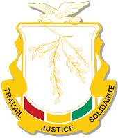

# Guide d'utilisation - PASS.MAEGE

## Introduction

Bienvenue sur la plateforme PASS.MAEGE, le service officiel de paiement en ligne pour les demandes de passeport guinéen. Ce guide vous accompagnera à travers les différentes fonctionnalités de la plateforme et vous expliquera comment effectuer votre demande de passeport étape par étape.

## Table des matières

1. [Premiers pas](#premiers-pas)
2. [Navigation sur la plateforme](#navigation-sur-la-plateforme)
3. [Processus de demande de passeport](#processus-de-demande-de-passeport)
4. [Gestion de votre compte](#gestion-de-votre-compte)
5. [Suivi de votre demande](#suivi-de-votre-demande)
6. [Foire aux questions](#foire-aux-questions)
7. [Assistance](#assistance)

## Premiers pas

### Accès à la plateforme

La plateforme PASS.MAEGE est accessible à l'adresse [www.pass-maege.gov.gn](https://www.pass-maege.gov.gn) (lien fictif pour la documentation).

### Choix de la langue

PASS.MAEGE est entièrement disponible en français et en anglais. Vous pouvez changer la langue à tout moment en utilisant le sélecteur de langue situé dans la barre de navigation ou dans le pied de page.

### Création d'un compte

1. Cliquez sur "Connexion" dans la barre de navigation
2. Sélectionnez "S'inscrire" ou "Je n'ai pas d'identifiants"
3. Remplissez le formulaire avec vos informations personnelles
4. Validez votre adresse email en cliquant sur le lien reçu par email
5. Connectez-vous avec vos identifiants

## Navigation sur la plateforme

### Barre de navigation

La barre de navigation contient les liens suivants :

- **Accueil** : Page d'accueil de la plateforme
- **Payer** : Accès au formulaire de demande et de paiement
- **Comment procéder** : Guide détaillé sur la procédure
- **FAQ** : Questions fréquemment posées
- **Support** : Assistance et contact
- **Connexion** : Accès à votre compte personnel

### Pied de page

Le pied de page contient :

- Des liens rapides vers les sections principales
- Le sélecteur de langue
- Les mentions légales et informations de copyright
- Le logo du gouvernement guinéen

## Processus de demande de passeport

Le processus de demande de passeport se déroule en 6 étapes simples :

### Étape 1 : Informations personnelles

 *(image fictive)*

- Saisissez votre prénom et nom de famille exactement comme ils apparaissent sur vos documents officiels
- Si vous faites une demande pour une autre personne, indiquez les informations du demandeur, pas les vôtres

### Étape 2 : Date de naissance

 *(image fictive)*

- Sélectionnez le jour, le mois et l'année de naissance
- Utilisez les menus déroulants pour choisir les valeurs correctes

### Étape 3 : Genre

 *(image fictive)*

- Sélectionnez "Homme" ou "Femme" selon le genre du demandeur

### Étape 4 : Lieu d'enrôlement

 *(image fictive)*

- Sélectionnez le pays où vous souhaitez effectuer l'enrôlement
- Choisissez l'ambassade ou le consulat spécifique

### Étape 5 : Validité du passeport

 *(image fictive)*

- Choisissez entre un passeport de 5 ans (153.54 USD) ou de 10 ans (307.08 USD)
- Les prix sont affichés en dollars américains (USD)

### Étape 6 : Résumé et confirmation

 *(image fictive)*

- Vérifiez attentivement toutes les informations saisies
- Cochez la case de confirmation
- Cliquez sur "Payer maintenant" pour procéder au paiement

### Navigation entre les étapes

- Utilisez le bouton "Continuer" pour passer à l'étape suivante
- Utilisez le bouton "Retour" pour revenir à l'étape précédente
- La barre de progression en haut de la page indique votre avancement

### Paiement

Après avoir confirmé vos informations, vous serez redirigé vers notre système de paiement sécurisé où vous pourrez :

1. Choisir votre méthode de paiement (carte de crédit, virement bancaire, mobile money)
2. Saisir les informations de paiement
3. Confirmer la transaction
4. Recevoir une confirmation par email avec votre reçu

## Gestion de votre compte

### Tableau de bord

Une fois connecté, vous accédez à votre tableau de bord personnel qui vous permet de :

- Voir l'historique de vos demandes
- Suivre l'état d'avancement de vos demandes en cours
- Télécharger vos reçus de paiement
- Mettre à jour vos informations personnelles

### Modification de votre profil

Pour modifier vos informations personnelles :

1. Connectez-vous à votre compte
2. Accédez à la section "Mon profil"
3. Cliquez sur "Modifier" à côté des informations que vous souhaitez mettre à jour
4. Enregistrez vos modifications

## Suivi de votre demande

### Statuts de demande

Votre demande peut avoir différents statuts :

- **En attente de paiement** : Le paiement n'a pas encore été effectué
- **Paiement confirmé** : Le paiement a été reçu et validé
- **En traitement** : Votre demande est en cours de traitement
- **Prêt pour enrôlement** : Vous pouvez vous présenter à l'ambassade/consulat choisi
- **Passeport émis** : Votre passeport est prêt
- **Livré** : Vous avez récupéré votre passeport

### Notifications

Vous recevrez des notifications par email à chaque changement de statut de votre demande.

## Foire aux questions

### Questions générales

**Q : Qui peut utiliser cette plateforme ?**  
R : Tous les citoyens guinéens souhaitant faire une demande de passeport, qu'ils résident en Guinée ou à l'étranger.

**Q : Puis-je faire une demande pour quelqu'un d'autre ?**  
R : Oui, vous pouvez effectuer une demande par procuration. Assurez-vous de saisir les informations de la personne concernée, pas les vôtres.

### Questions techniques

**Q : Comment puis-je reprendre une demande non terminée ?**  
R : Cliquez sur "Reprendre un processus" en bas de la page de paiement et connectez-vous à votre compte.

**Q : Que faire si je rencontre une erreur pendant le paiement ?**  
R : Contactez notre service d'assistance en cliquant sur "Support" dans la barre de navigation.

## Assistance

### Contact

Pour toute question ou assistance, vous pouvez :

- Consulter la section FAQ
- Envoyer un message via le formulaire de contact dans la section "Support"
- Envoyer un email à support@pass-maege.gov.gn (adresse fictive pour la documentation)
- Appeler notre service client au +224 XX XX XX XX (numéro fictif pour la documentation)

### Horaires d'assistance

Notre service client est disponible du lundi au vendredi, de 8h à 17h (GMT).

---

© 2025 PASS.MAEGE - Tous droits réservés
